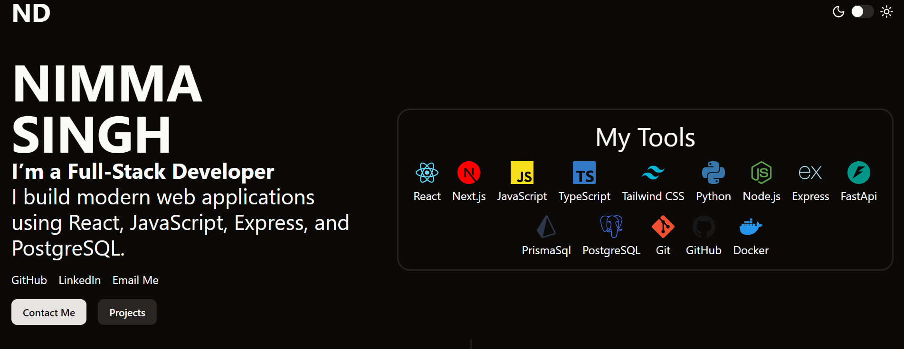
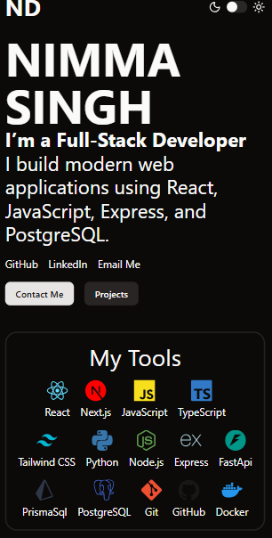

# Personal Portfolio

A modern, responsive personal portfolio website built with React, TypeScript, Shadcn/ui and Tailwind CSS. Showcases projects, skills, and provides a contact form for inquiries.

## Screenshot

### desktop



#### mobile



## Features

- **Hero Section**: Introduction and tech stack display.
- **Projects Section**: Interactive project cards with links and images.
- **Contact Form**: Integrated form using Web3Forms for message submissions.
- **Theme Toggle**: Dark/light mode switch with local storage persistence.
- **Responsive Design**: Optimized for desktop and mobile devices.
- **Accessibility**: Built with Shadcn UI components for better accessibility.

## Tech Stack

- **Frontend**: React, TypeScript, Tailwind CSS
- **Build Tool**: Vite
- **UI Components**: shadcn/ui
- **Icons**: Lucide React
- **Form Handling**: React Hook Form
- **Styling**: Tailwind CSS with custom CSS variables
- **Backend Integration**: Web3Forms API for contact form

## Installation

1. Clone the repository:

   ```bash
   git clone https://github.com/your-username/portfolio.git
   cd portfolio
   ```

2. Install Dependencies:

   ```bash
   npm install
   or
   bun install
   ```

3. Run Project:
   ```bash
   npm run dev
   or
   bun dev
   ```
